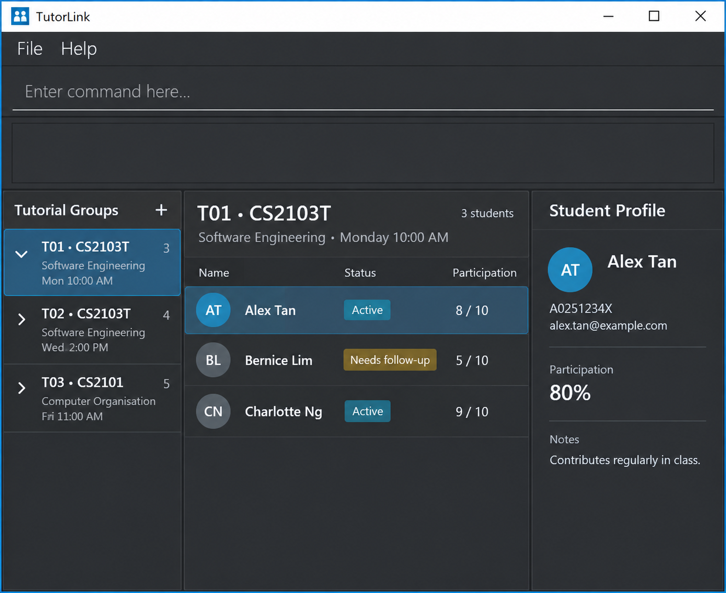

# TutorLink

## Overview

TutorLink is a desktop application designed to help tutors manage their tutorial groups and student information efficiently.

It brings tutorial and student records together in one place, allowing tutors to organise their classes, access student profiles, and keep track of student participation. TutorLink combines a graphical user interface with command-based interactions for a fast and convenient workflow.

## Target Users

TutorLink is intended for tutors who manage one or more tutorial groups and need a convenient way to organise student information.

## Key Features

* **Tutorial Management** — Create, view, edit, and delete tutorial groups.
* **Student Management** — Add and manage students within their respective tutorial groups.
* **Student Profiles** — View student information, participation records, and notes.
* **Search** — Search for tutorial groups and students using relevant keywords.

## Documentation

For more information about TutorLink, visit our [Project Website](https://ay2627s1-cs2103t-t13-4.github.io/tp/).

You can also refer to the:

* [User Guide](https://ay2627s1-cs2103t-t13-4.github.io/tp/UserGuide.html)
* [Developer Guide](https://ay2627s1-cs2103t-t13-4.github.io/tp/DeveloperGuide.html)

## Acknowledgements

This project is based on the [AddressBook-Level3](https://github.com/se-edu/addressbook-level3) project created by the [SE-EDU initiative](https://se-education.org).
