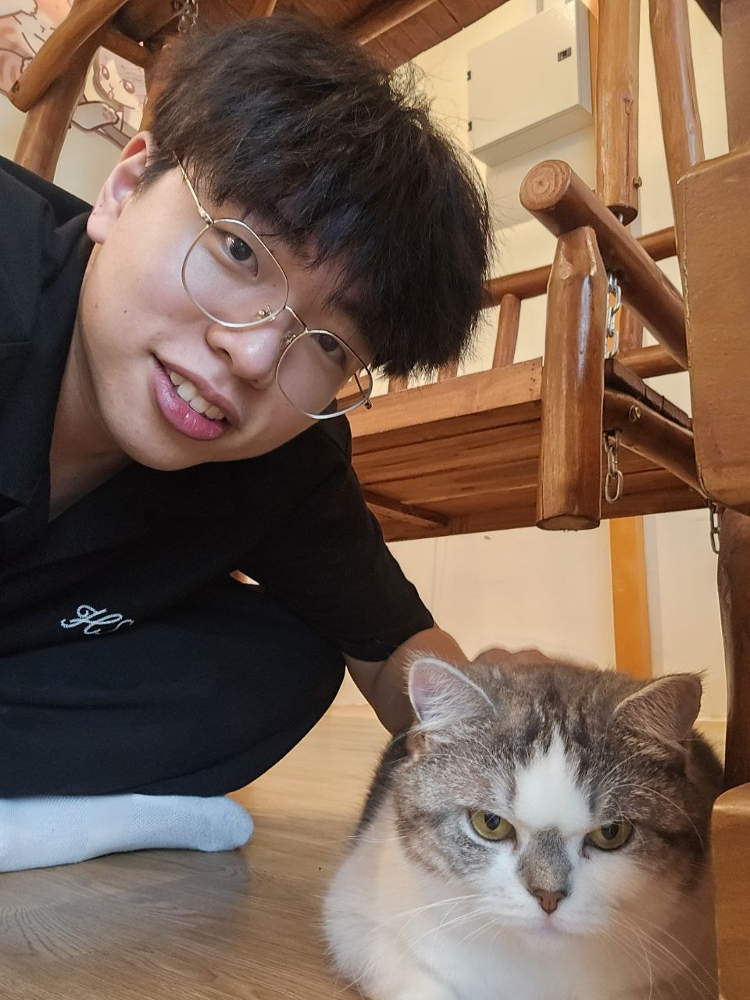
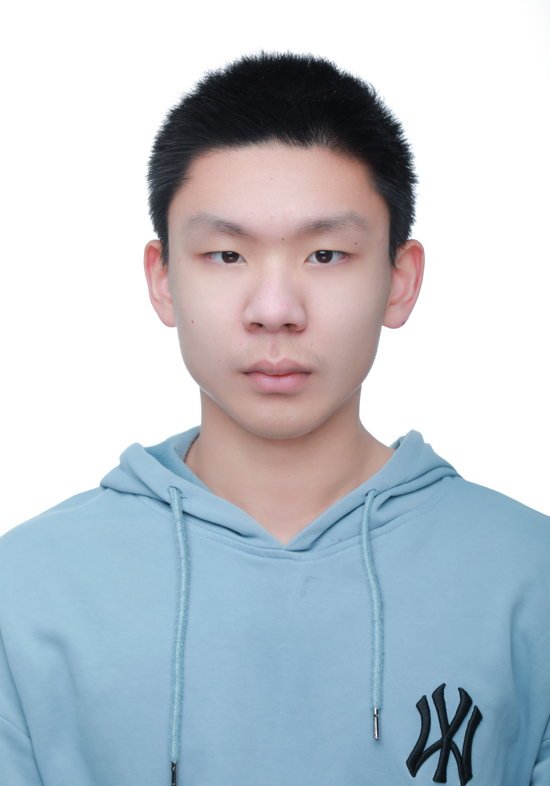
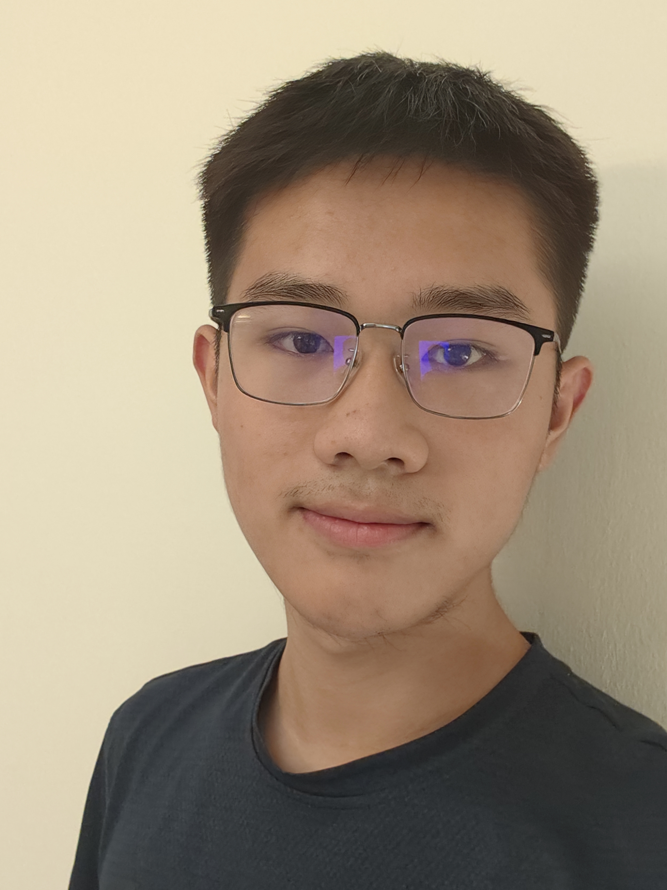
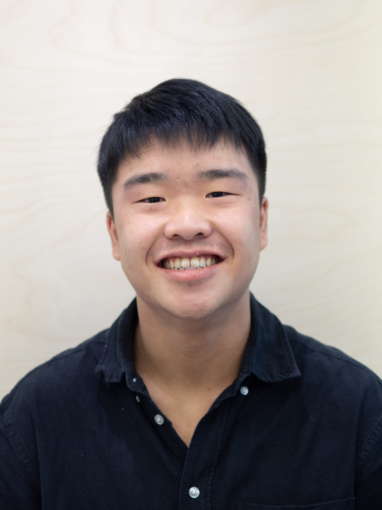
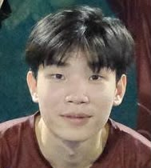

# About Us

We are a team based in the [School of Computing, National University of Singapore](http://www.comp.nus.edu.sg).

You can reach us at the email `seer[at]comp.nus.edu.sg`

## Project team

### Ni Zhiyuan

[[github](https://github.com/zzzhiyuan-77)]

* Role: Developer
* Responsibilities: Developer

### Hu Xiuyuan

[[github](https://github.com/HXY070103)]

* Role: Developer
* Responsibilities: Developer

### Xu Zhenyao

[[github](http://github.com/little-zhenyao)]

* Role: Developer
* Responsibilities: UI

### Johnny Doe

[[github](http://github.com/johndoe)] [[portfolio](team/johndoe.md)]

* Role: Developer
* Responsibilities: Data

### Fang Pin Xin

[[github](https://github.com/pinxinfang)]

* Role: Developer
* Responsibilities: Development, testing, and documentation

### Deron Chan

[[github](http://github.com/dafadlaw)]

* Role: Developer
* Responsibilities: UI
